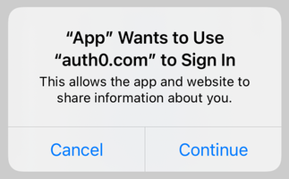

# auth0_flutter (Early Access)

[](https://circleci.com/gh/auth0/auth0-flutter/tree/main)

Auth0 SDK for Android / iOS Flutter applications.

> ⚠️ This library is currently in Early Access. We do not recommend using this library in production yet. As we move towards Beta, please be aware that releases may contain breaking changes.

---

## Table of Contents

<!-- - [**Documentation**](#documentation) -->
- [**Requirements**](#requirements)
- [**Installation**](#installation)
- [**Getting Started**](#getting-started)
  + [Configuration](#configuration)
  + [Web Auth Configuration](#web-auth-configuration)
  + [Web Auth Login](#web-auth-login)
  + [Web Auth Logout](#web-auth-logout)
  + [SSO Alert Box (iOS)](#sso-alert-box-ios)
- [**Next Steps**](#next-steps)
  <!-- + [Common Tasks](#common-tasks) -->
  + [Web Auth](#web-auth)
  + [API](#api)
- [**Advanced Features**](#advanced-features)
  + [Organizations](#organizations)
  + [Bot Detection](#bot-detection)
- [**Issue Reporting**](#issue-reporting)
- [**What is Auth0?**](#what-is-auth0)
- [**License**](#license)

<!-- 
## Documentation

TBD
-->

## Requirements

| Flutter    | Android         |iOS                |
|:-----------|:----------------|:------------------|
| SDK 2.10+  | Android API 21+ | iOS 12+           |
| Dart 2.16+ | Java 8+         | Swift 5.3+        |
|            |                 | Xcode 12.x / 13.x |

## Installation

During the Early Access stage the SDK will not be published to Pub.dev, but you can install it as a [path package](https://dart.dev/tools/pub/dependencies#path-packages). Extract the contents of the provided zip file and then add the following dependency in your `pubspec.yaml`:

```yaml
auth0_flutter:
    path: path/to/auth0_flutter
```

Then run `flutter pub get`.

## Getting Started

### Configuration

auth0_flutter needs the **Client ID** and **Domain** of the Auth0 application to communicate with Auth0. You can find these details on the settings page of your [Auth0 application](https://manage.auth0.com/#/applications/). If you are using a [Custom Domain](https://auth0.com/docs/brand-and-customize/custom-domains), use the value of your Custom Domain instead of the value from the settings page.

> ⚠️ Make sure that the [application type](https://auth0.com/docs/configure/applications) of the Auth0 application is **Native**. If you don’t have a Native Auth0 application already, [create one](https://auth0.com/docs/get-started/create-apps/native-apps) before continuing.

```dart
final auth0 = Auth0('YOUR_AUTH0_DOMAIN', 'YOUR_AUTH0_CLIENT_ID');
```

### Web Auth Configuration

#### Configure callback and logout URLs

The callback and logout URLs are the URLs that Auth0 invokes to redirect back to your application. Auth0 invokes the callback URL after authenticating the user, and the logout URL after removing the session cookie.

Since callback and logout URLs can be manipulated, you will need to add your URLs to the **Allowed Callback URLs** and **Allowed Logout URLs** fields in the settings page of your Auth0 application. This will enable Auth0 to recognize these URLs as valid. If the callback and logout URLs are not set, users will be unable to log in and out of the application and will get an error.

Go to the settings page of your [Auth0 application](https://manage.auth0.com/#/applications/) and add the corresponding URLs to **Allowed Callback URLs** and **Allowed Logout URLs**, according to the platforms used by your application. If you are using a [Custom Domain](https://auth0.com/docs/brand-and-customize/custom-domains), replace `YOUR_AUTH0_DOMAIN` with the value of your Custom Domain instead of the value from the settings page.

##### Android

```text
https://YOUR_AUTH0_DOMAIN/android/YOUR_APP_PACKAGE_NAME/callback
```

E.g. if your Auth0 Domain was `company.us.auth0.com` and your Android app package name was `com.company.myapp`, then this value would be:

```text
https://company.us.auth0.com/android/com.company.myapp/callback
```

##### iOS

```text
YOUR_BUNDLE_IDENTIFIER://YOUR_AUTH0_DOMAIN/ios/YOUR_BUNDLE_IDENTIFIER/callback
```

E.g. if your iOS bundle identifier was `com.company.myapp` and your Auth0 Domain was `company.us.auth0.com`, then this value would be:

```text
com.company.myapp://company.us.auth0.com/ios/com.company.myapp/callback
```

#### Android configuration: manifest placeholders

Open the `android/build.gradle` file and add the following manifest placeholders inside `android > defaultConfig`. The `applicationId` value will be auto-replaced at runtime with your Android app package name. 

```groovy
// android/build.gradle

android {
    // ...
    defaultConfig {
        // ...
        // Add the following line
        manifestPlaceholders = [auth0Domain: "YOUR_AUTH0_DOMAIN", auth0Scheme: "${applicationId}"]
    }
    // ...
}
```

E.g. if your Auth0 Domain was `company.us.auth0.com`, then the manifest placeholders line would be:

```groovy
manifestPlaceholders = [auth0Domain: "company.us.auth0.com", auth0Scheme: "${applicationId}"]
```

> 💡 If your Android application is using [product flavors](https://developer.android.com/studio/build/build-variants#product-flavors), you might need to specify different manifest placeholders for each flavor.

##### Skipping the Web Auth configuration

If you don't plan to use Web Auth, you will notice that the compiler will still prompt you to provide the `manifestPlaceholders` values, since the `RedirectActivity` included in this library will require them, and the Gradle tasks won't be able to run without them.

Re-declare the activity manually using `tools:node="remove"` in the `android/src/main/AndroidManifest.xml` file to make the [manifest merger](https://developer.android.com/studio/build/manage-manifests#merge-manifests) remove it from the final manifest file. Additionally, one more unused activity can be removed from the final APK by using the same process. A complete snippet to achieve this is:

```xml
<!-- android/src/main/AndroidManifest.xml -->

<manifest xmlns:android="http://schemas.android.com/apk/res/android"
    xmlns:tools="http://schemas.android.com/tools"
    package="com.company.myapp">
    <application android:theme="@style/AppTheme">
        <!-- ... -->
  
        <activity
            android:name="com.auth0.android.provider.AuthenticationActivity"
            tools:node="remove"/>
        <!-- Optional: Remove RedirectActivity -->
        <activity
            android:name="com.auth0.android.provider.RedirectActivity"
            tools:node="remove"/>
  
        <!-- ... -->
    </application>
</manifest>
```

#### iOS configuration: custom URL scheme

Open the `ios/Runner/Info.plist` file and add the following snippet inside the top-level `<dict>` tag. This registers your iOS Bundle Identifer as a custom URL scheme, so the callback and logout URLs can reach your application.

```xml
<!-- ios/Runner/Info.plist -->

<?xml version="1.0" encoding="UTF-8"?>
<!DOCTYPE plist PUBLIC "-//Apple//DTD PLIST 1.0//EN" "http://www.apple.com/DTDs/PropertyList-1.0.dtd">
<plist version="1.0">
<dict>
<!-- ... -->

    <key>CFBundleURLTypes</key>
    <array>
        <dict>
            <key>CFBundleTypeRole</key>
            <string>None</string>
            <key>CFBundleURLName</key>
            <string>auth0</string>
            <key>CFBundleURLSchemes</key>
            <array>
                <string>$(PRODUCT_BUNDLE_IDENTIFIER)</string>
            </array>
        </dict>
    </array>
  
<!-- ... -->
</dict>
</plist>
```

> 💡 If you're opening the `Info.plist` file in Xcode and it is not being shown in this format, you can **Right Click** on `Info.plist` in the Xcode [project navigator](https://developer.apple.com/library/archive/documentation/ToolsLanguages/Conceptual/Xcode_Overview/NavigatingYourWorkspace.html) and then select **Open As > Source Code**.

### Web Auth Login

Import auth0_flutter in the file where you want to present the login page.

```dart
import 'package:auth0_flutter/auth0_flutter.dart';
```

Then, present the [Universal Login](https://auth0.com/docs/authenticate/login/auth0-universal-login) page in the `onPressed` callback of your **Login** button.

```dart
final result = await auth0.webAuthentication.login();
```

<details>
  <summary>Add an audience value</summary>

  Specify an [audience](https://auth0.com/docs/secure/tokens/access-tokens/get-access-tokens#control-access-token-audience) to obtain an Access Token that can be used to make authenticated requests to a backend. The audience value is the **API Identifier** of your [Auth0 API](https://auth0.com/docs/get-started/apis), e.g. `https://example.com/api`.

  ```dart
  final result = await auth0.webAuthentication
      .login(audience: 'YOUR_AUTH0_API_IDENTIFIER');
  ```
</details>

<details>
  <summary>Add scope values</summary>

  Specify [scopes](https://auth0.com/docs/get-started/apis/scopes) to request permission to access protected resources, like the user profile. The default scope values are `openid`, `profile` and `email`. Regardless of the values specified, `openid` is always included.

  ```dart
  final result = await auth0.webAuthentication
      .login(scopes: {'profile', 'email', 'offline_access', 'read:todos'});
  ```
</details>

<details>
  <summary>Add a custom scheme value (Android only)</summary>

  On Android, auth0_flutter uses `https` by default as the callback URL scheme. This works best for Android API 23+ if you're using [Android App Links](https://auth0.com/docs/get-started/applications/enable-android-app-links-support), but in previous Android versions this _may_ show the intent chooser dialog prompting the user to choose either your application or the browser. You can change this behavior by using a custom unique scheme so that Android opens the link directly with your app. Note that schemes [can only have lowercase letters](https://developer.android.com/guide/topics/manifest/data-element).

  1. Update the `auth0Scheme` manifest placeholder on the `android/build.gradle` file.
  2. Update the **Allowed Callback URLs** in the settings page of your [Auth0 application](https://manage.auth0.com/#/applications/).
  3. Pass the scheme value to the `login()` method.

  ```dart
  final result = await auth0.webAuthentication.login(scheme: {'demo'});
  ```
</details>

### Web Auth Logout

Logging the user out involves clearing the Universal Login session cookie and then deleting the user's credentials from your application.

Call the `logout()` method in the in the `onPressed` callback of your **Logout** button. Once the session cookie has been cleared, delete the user's credentials.<!--  link to the section on deleting the stored credentials -->

```dart
await auth0.webAuthentication.logout();
```

### SSO Alert Box (iOS)



Check the [FAQ](FAQ.md) for more information about the alert box that pops up **by default** when using Web Auth on iOS.

> 💡 See also [this blog post](https://developer.okta.com/blog/2022/01/13/mobile-sso) for a detailed overview of Single Sign-On (SSO) on iOS.

[Go up ⤴](#table-of-contents)

## Next Steps

<!-- 
### Common Tasks

TBD
-->

### Web Auth

<!-- **See all the available features in the API documentation ↗** [link to API documentation] -->

- [Web Auth signup](#web-auth-signup)
- [ID Token validation](#id-token-validation)
- [Web Auth errors](#web-auth-errors)

#### Web Auth signup

You can make users land directly on the Signup page instead of the Login page by specifying the `'screen_hint': 'signup'` parameter. Note that this can be combined with `'prompt': 'login'`, which indicates whether you want to always show the authentication page or you want to skip if there's an existing session.

| Parameters                                     | No existing session   | Existing session              |
|:-----------------------------------------------|:----------------------|:------------------------------|
| No extra parameters                            | Shows the login page  | Redirects to the callback url |
| `'screen_hint': 'signup'`                      | Shows the signup page | Redirects to the callback url |
| `'prompt': 'login'`                            | Shows the login page  | Shows the login page          |
| `'prompt': 'login', 'screen_hint': 'signup'`   | Shows the signup page | Shows the signup page         |

```dart
final result = await auth0.webAuthentication
    .login(parameters: {'screen_hint': 'signup'});
```

> ⚠️ The `screen_hint` parameter will work with the **New Universal Login Experience** without any further configuration. If you are using the **Classic Universal Login Experience**, you need to customize the [login template](https://manage.auth0.com/#/login_page) to look for this parameter and set the `initialScreen` [option](https://github.com/auth0/lock#database-options) of the `Auth0Lock` constructor.

#### ID Token validation

auth0_flutter automatically [validates](https://auth0.com/docs/secure/tokens/id-tokens/validate-id-tokens) the ID Token obtained from Web Auth login, following the [OpenID Connect specification](https://openid.net/specs/openid-connect-core-1_0.html). This ensures the contents of the ID Token have not been tampered with and can be safely used.

##### Custom Domains

Users of Auth0 Private Cloud with Custom Domains still on the [legacy behavior](https://auth0.com/docs/deploy/private-cloud/private-cloud-migrations/migrate-private-cloud-custom-domains) need to specify a custom issuer to match the Auth0 Domain when performing Web Auth login. Otherwise, the ID Token validation will fail.

```dart
final config = IdTokenValidationConfig(issuer: 'https://YOUR_AUTH0_DOMAIN/');
final result =
    await auth0.webAuthentication.login(idTokenValidationConfig: config);
```

#### Web Auth errors

Web Auth will only throw `WebAuthException` exceptions. You can find the error information in the `details` property of the exception value.<!-- Check the API documentation [link to API documentation] to learn more about the available `WebAuthException` properties. -->

### API

<!-- **See all the available features in the API documentation ↗** [link to API documentation] -->

- [Login with database connection](#login-with-database-connection)
- [Sign up with database connection](#sign-up-with-database-connection)
- [Retrieve user information](#retrieve-user-information)
- [Renew credentials](#renew-credentials)
- [API client errors](#api-client-errors)

The Authentication API exposes the AuthN/AuthZ functionality of Auth0, as well as the supported identity protocols like OpenID Connect, OAuth 2.0, and SAML.
We recommend using [Universal Login](https://auth0.com/docs/authenticate/login/auth0-universal-login), but if you prefer to build your own UI you can use our API endpoints to do so. However, some Auth flows (grant types) are disabled by default so you must enable them in the settings page of your [Auth0 application](https://manage.auth0.com/#/applications/), as explained in [Update Grant Types](https://auth0.com/docs/get-started/applications/update-grant-types).

For login or signup with username/password, the `Password` grant type needs to be enabled in your application. If you set the grants via the Management API you should activate both `http://auth0.com/oauth/grant-type/password-realm` and `Password`. Otherwise, the Auth0 Dashboard will take care of activating both when enabling `Password`.

> 💡 If your Auth0 account has the **Bot Detection** feature enabled, your requests might be flagged for verification. Check how to handle this scenario in the [Bot Detection](#bot-detection) section.

> ⚠️ The ID Tokens obtained from Web Auth login are automatically validated by auth0_flutter, ensuring their contents have not been tampered with. **This is not the case for the ID Tokens obtained from the Authentication API client.** You must [validate](https://auth0.com/docs/security/tokens/id-tokens/validate-id-tokens) any ID Tokens received from the Authentication API client before using the information they contain.

#### Login with database connection

```dart
final result = await auth0.api.login(
    usernameOrEmail: 'jane.smith@example.com',
    password: 'secret-password',
    connectionOrRealm: 'Username-Password-Authentication');
```

<details>
  <summary>Add an audience value</summary>

  Specify an [audience](https://auth0.com/docs/secure/tokens/access-tokens/get-access-tokens#control-access-token-audience) to obtain an Access Token that can be used to make authenticated requests to a backend. The audience value is the **API Identifier** of your [Auth0 API](https://auth0.com/docs/get-started/apis), e.g. `https://example.com/api`.

  ```dart
  final result = await auth0.api.login(
      usernameOrEmail: 'jane.smith@example.com',
      password: 'secret-password',
      connectionOrRealm: 'Username-Password-Authentication',
      audience: 'YOUR_AUTH0_API_IDENTIFIER');
  ```
</details>

<details>
  <summary>Add scope values</summary>

  Specify [scopes](https://auth0.com/docs/get-started/apis/scopes) to request permission to access protected resources, like the user profile. The default scope values are `openid`, `profile` and `email`. Regardless of the values specified, `openid` is always included.

  ```dart
  final result = await auth0.api.login(
      usernameOrEmail: 'jane.smith@example.com',
      password: 'secret-password',
      connectionOrRealm: 'Username-Password-Authentication',
      scopes: {'profile', 'email', 'offline_access', 'read:todos'});
  ```
</details>

#### Sign up with database connection

```dart
final user = await auth0.api.signup(
    email: 'jane.smith@example.com',
    password: 'secret-password',
    connection: 'Username-Password-Authentication',
    userMetadata: {'first_name': 'Jane', 'last_name': 'Smith'});
```

> 💡 You might want to log the user in after signup. See [Login with database connection](#login-with-database-connection) above for an example.

#### Retrieve user information

Fetch the latest user information from the `/userinfo` endpoint.

This method will yield a `UserProfile` instance.<!--Check the API documentation [link to API documentation] to learn more about its available properties. -->

```dart
final userProfile = await auth0.api.userInfo(accessToken: accessToken);
```

#### Renew credentials

Use a [Refresh Token](https://auth0.com/docs/secure/tokens/refresh-tokens) to renew the user's credentials. It's recommended that you read and understand the Refresh Token process beforehand.

```dart
final result = await auth0.api.renewCredentials(refreshToken: refreshToken);
```

> 💡 To obtain a Refresh Token, make sure your Auth0 application has the **Refresh Token** [grant enabled](https://auth0.com/docs/get-started/applications/update-grant-types). If you are also specifying an audience value, make sure that the corresponding Auth0 API has the **Allow Offline Access** [setting enabled](https://auth0.com/docs/get-started/apis/api-settings#access-settings).

#### API client errors

The Authentication API client will only throw `ApiException` exceptions. You can find the error information in the `details` property of the exception value.<!--Check the API documentation [link to API documentation] to learn more about the available `ApiException` properties. -->

[Go up ⤴](#table-of-contents)

## Advanced Features

### Organizations

[Organizations](https://auth0.com/docs/manage-users/organizations) is a set of features that provide better support for developers who build and maintain SaaS and Business-to-Business (B2B) applications. 

Using Organizations, you can:

- Represent teams, business customers, partner companies, or any logical grouping of users that should have different ways of accessing your applications, as organizations.
- Manage their membership in a variety of ways, including user invitation.
- Configure branded, federated login flows for each organization.
- Implement role-based access control, such that users can have different roles when authenticating in the context of different organizations.
- Build administration capabilities into your products, using Organizations APIs, so that those businesses can manage their own organizations.

> 💡 Organizations is currently only available to customers on our Enterprise and Startup subscription plans.

#### Log in to an organization

```dart
final result = await auth0.webAuthentication
    .login(organizationId: 'YOUR_AUTH0_ORGANIZATION_ID');
```

#### Accept user invitations

To accept organization invitations your application needs to support [deep linking](https://docs.flutter.dev/development/ui/navigation/deep-linking), as invitation links are HTTPS-only. Tapping on the invitation link should open your application.

When your application gets opened by an invitation link, grab the invitation URL and pass it to the `login()` method.

```dart
final result = await auth0.webAuthentication.login(invitationUrl: url);
```

### Bot Detection

If you are performing database login/signup via the Authentication API and would like to use the [Bot Detection](https://auth0.com/docs/secure/attack-protection/bot-detection) feature, you need to handle the `isVerificationRequired` error. It indicates that the request was flagged as suspicious and an additional verification step is necessary to log the user in. That verification step is web-based, so you need to use Web Auth to complete it.

```dart
try {
  final result = await auth0.api.login(
      usernameOrEmail: email,
      password: password,
      connectionOrRealm: connection,
      scopes: scopes);
  // ...
} on ApiException catch (e) {
  if (e.isVerificationRequired) {
    final result = await auth0.webAuthentication.login(
        scopes: scopes,
        useEphemeralSession: true, // Otherwise a session cookie will remain (iOS only)
        parameters: {
          'connection': connection,
          'login_hint': email // So the user doesn't have to type it again
        });
    // ...
  }
}
```

## Issue Reporting

For general support or usage questions, use the [Auth0 Community](https://community.auth0.com/c/sdks/5) forums or raise a [support ticket](https://support.auth0.com/). Only [raise an issue](https://github.com/auth0/auth0_flutter/issues) if you have found a bug or want to request a feature.

**Do not report security vulnerabilities on the public GitHub issue tracker.** The [Responsible Disclosure Program](https://auth0.com/responsible-disclosure-policy) details the procedure for disclosing security issues.

## What is Auth0?

Auth0 helps you to:

* Add authentication with [multiple sources](https://auth0.com/docs/authenticate/identity-providers), either social identity providers such as **Google, Facebook, Microsoft Account, LinkedIn, GitHub, Twitter, Box, Salesforce** (amongst others), or enterprise identity systems like **Windows Azure AD, Google Apps, Active Directory, ADFS, or any SAML Identity Provider**.
* Add authentication through more traditional **[username/password databases](https://auth0.com/docs/authenticate/database-connections/custom-db)**.
* Add support for **[linking different user accounts](https://auth0.com/docs/manage-users/user-accounts/user-account-linking)** with the same user.
* Support for generating signed [JSON Web Tokens](https://auth0.com/docs/secure/tokens/json-web-tokens) to call your APIs and **flow the user identity** securely.
* Analytics of how, when, and where users are logging in.
* Pull data from other sources and add it to the user profile through [JavaScript Actions](https://auth0.com/docs/customize/actions).

**Why Auth0?** Because you should save time, be happy, and focus on what really matters: building your product.

## License

This project is licensed under the MIT license. See the [LICENSE](LICENSE) file for more information.

---

[Go up ⤴](#table-of-contents)
